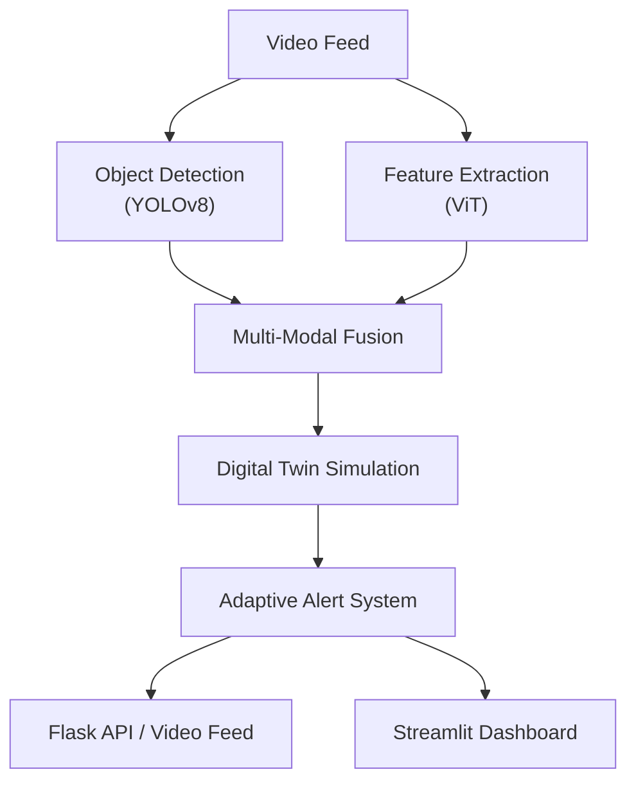

---

# Anveshak :- An AI-Powered Multi-Modal Surveillance System  
*Adaptive Alerts and Digital Twin Simulation for Modern Security*

[](https://github.com/yourusername/yourrepo)  
[](LICENSE)  
[](https://github.com/Vipul-Mhatre/Anveshak)  
[](https://github.com/Vipul-Mhatre/Anveshak)

---

## Table of Contents

- [Overview](#overview)
- [Introduction](#introduction)
- [Key Features and Contributions](#key-features-and-contributions)
- [System Architecture](#system-architecture)
  - [Architecture Diagram](#architecture-diagram)
- [Modules and Methodology](#modules-and-methodology)
  - [Object Detection and Classification](#object-detection-and-classification)
  - [Digital Twin Simulation](#digital-twin-simulation)
  - [Risk Assessment and Adaptive Alert System](#risk-assessment-and-adaptive-alert-system)
  - [Multi-Modal Data Fusion](#multi-modal-data-fusion)
- [Implementation Details](#implementation-details)
- [Installation](#installation)
- [Usage](#usage)
- [Experimental Evaluation](#experimental-evaluation)
- [References](#references)
- [Acknowledgments](#acknowledgments)
- [License](#license)
- [Contact and Contribution Guidelines](#contact-and-contribution-guidelines)
- [Future Work](#future-work)

---

## Overview

This repository implements an end-to-end **AI-powered surveillance system** that upgrades legacy infrastructures into real-time, adaptive monitoring solutions. By integrating state-of-the-art computer vision models with a digital twin simulation module and advanced multi-modal data fusion techniques, the system not only detects and classifies objects in real time but also predicts potential security threats and adapts alert thresholds dynamically.

---

## Introduction

Modern surveillance demands solutions that go beyond simple motion detection. Our system incorporates:

- **Object Detection:** Utilizing cutting-edge algorithms like YOLOv8 for real-time detection.
- **Semantic Understanding:** Leveraging Vision Transformers (ViT) to classify objects accurately.
- **Predictive Analytics:** Implementing LSTM-based predictors to forecast risk levels.
- **Digital Twin Simulation:** Creating a virtual replica of the physical environment to simulate and anticipate future states.
- **Adaptive Alerts:** Dynamically adjusting sensitivity thresholds based on historical and real-time data.
- **Multi-Modal Fusion:** Integrating visual, audio, and thermal inputs to enrich scene understanding and anomaly detection.

---

## Key Features and Contributions

- **Robust Object Detection & Classification:** Combines YOLOv8 and Vision Transformers for high-accuracy detection.
- **Predictive Risk Analysis:** Uses LSTM-based models to assess and forecast risk levels.
- **Digital Twin Module:** Maintains a dynamic model of the surveillance environment for proactive threat management.
- **Adaptive Alert Mechanism:** Employs dynamic thresholding to reduce false positives and ensure timely alerts.
- **Multi-Modal Data Fusion:** Integrates visual, audio, and thermal data for comprehensive scene analysis.
- **Scalable Architecture:** Designed with a Flask backend and a Streamlit dashboard for real-time analytics.
- **Extensive Experimental Evaluation:** Provides metrics such as processing FPS, detection accuracy, and alert responsiveness.

---

## System Architecture

The overall system is composed of several interconnected modules:

1. **Object Detection and Classification Module:** Detects objects from video feeds using YOLOv8 and classifies them with ViT.
2. **Digital Twin Simulation Module:** Continuously updates a digital replica of the environment based on real-time data.
3. **Risk Assessment Module:** Computes risk scores using both additive (SAW) and multiplicative (WPM) models.
4. **Adaptive Alert System:** Adjusts thresholds dynamically based on predictions from LSTM models.
5. **Multi-Modal Fusion Module:** Combines features from visual, audio, and thermal sensors to enhance detection.

### Architecture Diagram

Below is a diagram of the system architecture generated using Mermaid (ensure your Markdown viewer supports Mermaid):



---

## Modules and Methodology

### Object Detection and Classification

- **YOLOv8:** Utilized for real-time object detection in video frames.
- **Vision Transformers (ViT):** Extract high-level semantic features for accurate classification.
- **Integration:** Both models feed into the multi-modal fusion module to enhance overall system performance.

### Digital Twin Simulation

- **Dynamic Modeling:** Maintains an updated virtual replica of the surveillance environment.
- **State Updates:** Continuously updates with real-time detection data and environmental metrics.
- **Future Simulation:** Predicts potential future states and threat escalations.

### Risk Assessment and Adaptive Alert System

- **Risk Components:**  
  - **Threat Indicators:** Based on detection confidence, suspicious object counts, etc.
  - **Behavioral Patterns:** Analyzes motion trajectories and object displacements.
  - **Environmental Metrics:** Considers lighting, crowd density, and other factors.
- **Risk Aggregation Models:**  
  - **Simple Additive Weighting (SAW):**  
    $$
    R_{\text{SAW}} = w_{\text{threat}} \cdot R_{\text{threat}} + w_{\text{behavior}} \cdot R_{\text{behavior}} + w_{\text{environment}} \cdot R_{\text{environment}}
    $$
  - **Weighted Product Model (WPM):**  
    $$
    R_{\text{WPM}} = R_{\text{threat}}^{w_{\text{threat}}} \times R_{\text{behavior}}^{w_{\text{behavior}}} \times R_{\text{environment}}^{w_{\text{environment}}}
    $$
- **Overall Risk Computation:**  
  $$
  R_{\text{overall}} = \lambda \cdot \max\{ R_{\text{SAW}}, R_{\text{WPM}} \} + (1-\lambda) \cdot R_{\text{frame}}
  $$
- **Adaptive Thresholding:**  
  Updates the alert threshold dynamically based on LSTM-based predictions and historical alert data.

### Multi-Modal Data Fusion

- **Modalities:** Combines visual, audio, and thermal signals.
- **Feature Fusion:**  
  - Normalizes and fuses features from different modalities using a weighted sum:
    $$
    \mathbf{F}_{\text{fused}} = w_v \cdot \text{normalize}(\mathbf{F}_v) + w_a \cdot \text{normalize}(\mathbf{F}_a) + w_t \cdot \text{normalize}(\mathbf{F}_t)
    $$
- **Benefits:** Enhances scene understanding and improves anomaly detection accuracy.

---

## Implementation Details

- **Backend:**  
  - Developed in **Python** using **Flask** for API endpoints and real-time video streaming.
- **Dashboard:**  
  - A **Streamlit** dashboard provides interactive real-time analytics and visualization.
- **Deep Learning:**  
  - Built with **PyTorch** to implement YOLOv8, ViT, and LSTM predictors.
- **Image Processing:**  
  - **OpenCV** is used for video capture and frame processing.
- **Audio Processing:**  
  - **Librosa** extracts relevant audio features.
- **Asynchronous Processing:**  
  - Utilizes `ThreadPoolExecutor` to ensure high processing FPS and low latency.

---

## Installation

### Prerequisites

- Python 3.8 or higher
- PyTorch (compatible with your CUDA version)
- OpenCV, Librosa, Flask, Streamlit, and other dependencies (listed in `requirements.txt`)

### Setup

1. **Clone the Repository:**

   ```bash
   git clone https://github.com/yourusername/yourrepo.git
   cd yourrepo
   ```

2. **Create and Activate a Virtual Environment:**

   ```bash
   python -m venv venv
   source venv/bin/activate  # On Windows use `venv\Scripts\activate`
   ```

3. **Install Dependencies:**

   ```bash
   pip install -r requirements.txt
   ```

4. **Compile Diagrams (Optional):**  
   If you wish to modify or regenerate the LaTeX diagrams, navigate to the `/docs/diagrams/` directory and compile the `.tex` files using your preferred LaTeX editor.

---

## Usage

### Running the Backend

Start the Flask API and video stream:

```bash
python run.py
```

### Launching the Dashboard

In another terminal, run:

```bash
streamlit run dashboard.py
```

Visit `http://localhost:8501` in your browser to view real-time analytics.

### Running Tests

To run the test suite:

```bash
pytest
```

---

## Experimental Evaluation

The system has been extensively evaluated under standard video streaming conditions. Key performance metrics include:

- **Processing FPS:** Maintains high frame rates through asynchronous processing.
- **Detection Accuracy:** Verified through consistency in risk scores over time.
- **Alert Responsiveness:** Adaptive threshold updates reduce false positives and provide timely alerts.

Example plots (generated with TikZ in LaTeX) are available in the `/docs/diagrams/` directory.

---

## References

The following are key references used in this project:

- citeturn0search0 Redmon et al., "You Only Look Once: Unified, Real-Time Object Detection," CVPR 2016.
- citeturn0search0 Dosovitskiy et al., "An Image is Worth 16x16 Words: Transformers for Image Recognition at Scale," ICLR 2021.
- citeturn0search0 Hochreiter and Schmidhuber, "Long Short-Term Memory," Neural Computation, 1997.
- citeturn0search0 Atrey et al., "Multimodal Fusion for Multimedia Analysis: A Survey," Multimedia Systems, 2010.
- citeturn0search0 Tao et al., "Digital Twin Driven Smart Manufacturing: Connotation, Reference Model, Applications and Research Issues," IEEE Access, 2018.

*Additional citations and detailed discussions on the fusion strategies, digital twin simulation, and adaptive alerting mechanisms can be found in the project documentation.*

---

## Acknowledgments

- We thank the developers of YOLO, Vision Transformers, and the open-source community for their invaluable resources.
- Special thanks to the research groups and academic institutions whose publications have guided the development of this system.

---

## License

This project is licensed under the MIT License. See the [LICENSE](LICENSE) file for details.

---

## Contact and Contribution Guidelines

- **Project Lead:** Your Name (your.email@institution.edu)
- **Contributions:** Contributions are welcome! Please read our [CONTRIBUTING.md](CONTRIBUTING.md) for details on how to contribute.
- **Issues:** For bugs or feature requests, please open an issue in the GitHub repository.

---

## Future Work

- **Extended Sensor Integration:** Incorporate additional modalities such as radar and IoT sensor data.
- **Enhanced Digital Twin Simulation:** Improve simulation accuracy with advanced physics-based models.
- **Advanced Predictive Analytics:** Experiment with transformer-based temporal models for even better risk forecasting.
- **Scalability:** Optimize the system for deployment in large-scale, real-world surveillance applications.

---


